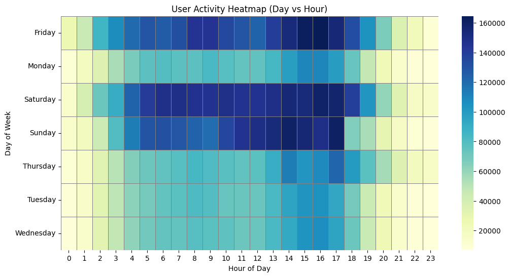

# 🛒 E-commerce Conversion Funnel Analysis (SQL + Python)

---

## 📌 Overview

This project analyzes user behavior in an e-commerce platform to understand how users move through the conversion funnel:

**View → Cart → Purchase**

The objective is to identify drop-off points, evaluate user intent, and provide data-driven recommendations to improve conversion rates.

This project combines **SQL (core analysis)** with **Python (EDA & visualization)** to deliver a complete analytical workflow.

---

## 📈 Visual Insights

### 🟦 User Activity Heatmap



- The heatmap visualizes user activity across different hours and days
- Darker regions indicate higher engagement levels
- Activity is concentrated during afternoon hours and weekends

### Key Takeaway

- High engagement periods do not always align with high conversion periods  
- This reinforces the need to separate **activity vs intent behavior**

---


## 📊 Dataset

- Source: E-commerce Events Dataset (November 2019)
- Records: ~67 million events
- Type: Event-level user interaction data

### Key Columns:
- `event_time`
- `event_type` (view, cart, purchase)
- `user_id`
- `product_id`
- `price`
- `user_session`

---

## 🧱 Project Structure

```
data/ → raw dataset
notebooks/ → Python EDA
sql/ → structured analytical queries
images/ → visual outputs
dashboard/ → (optional future work)

```


---

## 🔍 Analysis Approach

1. Data validation and quality checks (SQL)
2. Funnel construction (user-level)
3. Sequence-based funnel refinement (true user journey)
4. Price-based segmentation analysis
5. Time-based behavioral analysis
6. Business insights and recommendations

---

## 📊 Funnel Analysis

### 🔹 Loose Funnel (User-Level)

- View Users: **3.69M**
- Cart Users: **826K**
- Purchase Users: **441K**

- View → Cart: **22.36%**
- Cart → Purchase: **53.45%**
- Overall Conversion: **11.95%**

---

### 🔹 Sequence-Based Funnel (Strict)

- View Users: **3.69M**
- View → Cart Users: **823K**
- Purchase Users: **361K**

- View → Cart: **22.28%**
- Cart → Purchase: **43.86%**
- Overall Conversion: **9.77%**

👉 Sequence-based funnel reveals **~80K false conversions** in the loose model, providing a more accurate representation of user behavior.

---

## 💰 Price Segmentation Insights

| Segment | Overall Conversion |
|--------|------------------|
| Low    | **4.53%** |
| Medium | **10.63%** |
| High   | **10.40%** |

### Key Observations

- Low-price users show **high browsing but low intent**
- Medium-price users demonstrate the **highest conversion**
- High-price users also convert well, indicating **intent-driven behavior**
- Conversion is influenced more by **intent than price alone**

⚠️ Note: Presence of zero-value price records may slightly affect segmentation accuracy

---

## ⏰ Time-Based Insights

- Peak activity: **2 PM – 5 PM**
- Highest conversion: **9 AM – 11 AM**
- Weekend activity highest (Fri–Sat)
- Best conversion day: **Sunday (~2.2%)**

### Behavioral Insight

- Users **browse in the afternoon** but **convert in the morning**
- Friday shows high activity but lower conversion → browsing-heavy behavior

---

## 🧠 Key Insights

- Largest drop-off occurs at **View → Cart stage (~75%)**
- Only **~9.7% users complete the funnel in correct sequence**
- Loose funnel overestimates conversion → sequence matters
- Medium & high-value users show stronger purchase intent
- User behavior varies significantly across **time and intent levels**

---

## 🚀 Business Recommendations

### 1. Improve Early Funnel (View → Cart)
- Better product recommendations
- Clear pricing & value communication
- UX optimization

### 2. Target High-Intent Users
- Focus on medium & high-value segments
- Personalize offers based on behavior

### 3. Time-Based Optimization
- Run campaigns in **morning hours**
- Push promotions on **Sundays**

### 4. Reduce Friction
- Simplify cart & checkout experience
- Build trust signals (reviews, guarantees)

---

## 🛠️ Tools & Technologies

- **SQL (PostgreSQL)** → core analysis (CTEs, aggregations, funnel logic)
- **Python (Pandas, NumPy)** → data preprocessing
- **Matplotlib / Seaborn** → visualization
- **Jupyter Notebook**

---

## 📌 Conclusion

This analysis highlights that while user engagement is high, conversion is limited by weak intent formation in early funnel stages.

By aligning product strategy, pricing, and marketing efforts with user behavior patterns, businesses can significantly improve conversion performance.

---

## 📎 Future Improvements

- Build interactive dashboard (Power BI / Tableau)
- Apply cohort analysis
- Add user retention tracking
- Explore A/B testing strategies